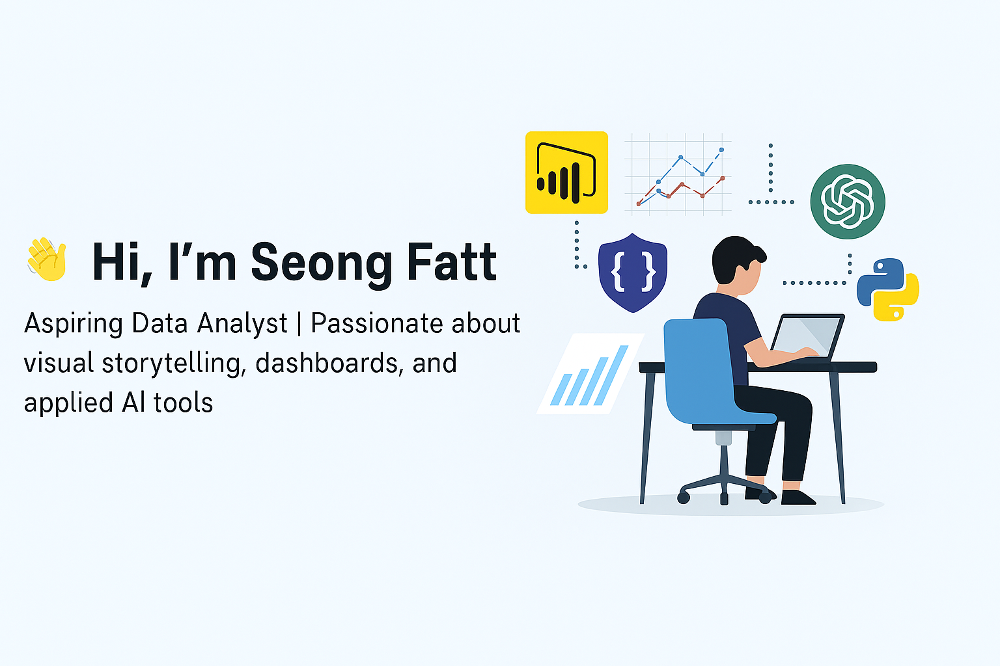

# 👋 Hi, I'm Seong Fatt  
Aspiring Data Analyst | Passionate about visual storytelling, dashboards, and applied AI tools

 <!-- Replace with actual image URL -->

---

## 🧠 About Me  
I'm a junior data analyst who recently completed the NTUC Associate Data Analyst program (June 2025). I'm building a strong foundation in data visualization, machine learning, and AI-assisted productivity.

---

## 🛠️ Tools & Skills

---

## 📊 Capstone Projects

  
🧠 Heart Disease Prediction

  Logistic regression model in Python (Jupyter) with Power BI dashboard integration.  

  
🏢 CRM Sales Dashboard

  Interactive quadrant analysis using RAG indicators and team performance insights.

  
🏠 Real Estate Business Analytics

  Power BI dashboard on HDB resale trends and price analysis.

  
🛒 E-Commerce Analytics

  Customer segmentation and purchase behavior insights with Power BI.

  
💰 Finance Machine Learning Model

  Python-based forecasting project in Jupyter Notebook.

---

## 🌱 Currently Learning

- Advanced DAX in Power BI  
- Git and GitHub version control  
- Data storytelling techniques  
- More hands-on projects and AI-powered analytics workflows

---

📫 Feel free to explore my repositories. Feedback and learning tips are always welcome!
